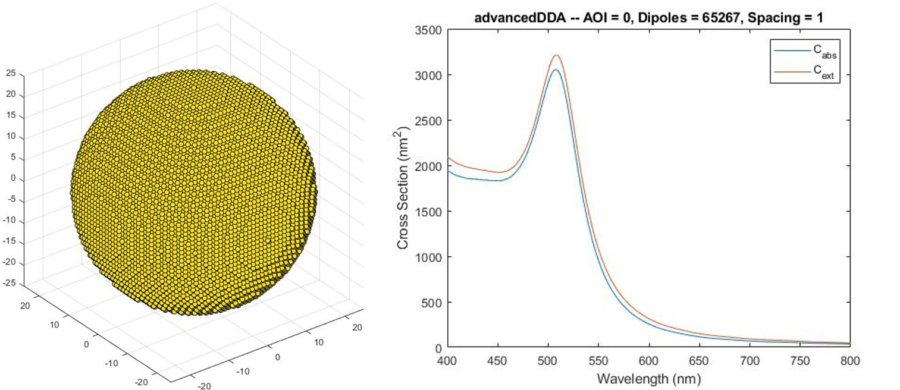

# 340_advancedDDA_GPU-optimized

*In the last section we utilized the GPU for significantly improving the performance by just making some slight changes to the code. Now, we dig a bit deeper to find the last optimizations.*

## Background and Implementation

One big bottleneck when working with GPUs is the data transfer from the CPU to the GPU and back. One can optimize it, but it is best to just avoid it. So, instead of creating the `fftA` on the GPU, gathering it with the CPU and then directly send it to the GPU again, it might be better to just leave it on the GPU. In Matlab this is not straight forward as it does not support memory management via references. But a suitable way to achieve it is by allocating the memory for `fftA` already in the *main program* and then pass `fftA` to the `create_fftA_gpu.m` function and return it back. At least this seems to work.

Another point, that is good to know, is that GPUs are optimized for single-precision floating point operations or short `f32` operations. However, Matlab uses by default `f64` double-precision floating point values which is a sensible choice for numerical computations as it reduces the impact of round-off errors. However, probably due to robustness of the FFT algorithm, `f32` values seems to be good enough for our problem. Hence, the `single` keyword was applied to all data structures to force Matlab to use `f32` values.

Finally, as QMR is just faster the CCG solver was removed to clean up the code.

## Code Changes

Changed Files           | Notes
:-----                  |:--------
advancedDDA.m           | main file
create_fftA_gpu.m       | build fftA on the GPU and leaf it there
myqmr_GPU.m             | QMR method using the GPU

## Results

The results of our standard example of a Gold sphere with the 50-nm diameter, 2.5-nm spacing and 4169 dipoles but now using the QMR method are:

    >> advancedDDA
    Building a 50nm x 50nm spheroid with 68921 grid points and 4169 dipoles
    wav = 400nm -- setting up: 0.0s -- solver: 0.007076   6   0.0s 
    wav = 410nm -- setting up: 0.0s -- solver: 0.009151   1   0.0s 
    wav = 420nm -- setting up: 0.0s -- solver: 0.009884   2   0.0s 
    wav = 430nm -- setting up: 0.0s -- solver: 0.005039   3   0.0s 
    wav = 440nm -- setting up: 0.0s -- solver: 0.006953   1   0.0s 
    wav = 450nm -- setting up: 0.0s -- solver: 0.008004   2   0.0s 
    wav = 460nm -- setting up: 0.0s -- solver: 0.009185   2   0.0s 
    wav = 470nm -- setting up: 0.0s -- solver: 0.009860   2   0.0s 
    wav = 480nm -- setting up: 0.0s -- solver: 0.009962   2   0.0s 
    wav = 490nm -- setting up: 0.0s -- solver: 0.005884   3   0.0s 
    wav = 500nm -- setting up: 0.0s -- solver: 0.007659   3   0.0s 
    wav = 510nm -- setting up: 0.0s -- solver: 0.008900   4   0.0s 
    wav = 520nm -- setting up: 0.0s -- solver: 0.008525   6   0.0s 
    wav = 530nm -- setting up: 0.0s -- solver: 0.008895   6   0.0s 
    wav = 540nm -- setting up: 0.0s -- solver: 0.009014   6   0.0s 
    wav = 550nm -- setting up: 0.0s -- solver: 0.009137   6   0.0s 
    wav = 560nm -- setting up: 0.0s -- solver: 0.009910   7   0.0s 
    wav = 570nm -- setting up: 0.0s -- solver: 0.009903   8   0.0s 
    wav = 580nm -- setting up: 0.0s -- solver: 0.008990   9   0.0s 
    wav = 590nm -- setting up: 0.0s -- solver: 0.009855   7   0.0s 
    wav = 600nm -- setting up: 0.0s -- solver: 0.009636   9   0.0s 
    wav = 610nm -- setting up: 0.0s -- solver: 0.009486   9   0.0s 
    wav = 620nm -- setting up: 0.0s -- solver: 0.009938   7   0.0s 
    wav = 630nm -- setting up: 0.0s -- solver: 0.009749   9   0.0s 
    wav = 640nm -- setting up: 0.0s -- solver: 0.009992   6   0.0s 
    wav = 650nm -- setting up: 0.0s -- solver: 0.009784   7   0.0s 
    wav = 660nm -- setting up: 0.0s -- solver: 0.009993   6   0.0s 
    wav = 670nm -- setting up: 0.0s -- solver: 0.009944   8   0.0s 
    wav = 680nm -- setting up: 0.0s -- solver: 0.009932   7   0.0s 
    wav = 690nm -- setting up: 0.0s -- solver: 0.009910   8   0.0s 
    wav = 700nm -- setting up: 0.0s -- solver: 0.009840   7   0.0s 
    wav = 710nm -- setting up: 0.0s -- solver: 0.009351   9   0.0s 
    wav = 720nm -- setting up: 0.0s -- solver: 0.009865   3   0.0s 
    wav = 730nm -- setting up: 0.0s -- solver: 0.009627  10   0.0s 
    wav = 740nm -- setting up: 0.0s -- solver: 0.009840   7   0.0s 
    wav = 750nm -- setting up: 0.0s -- solver: 0.009962  10   0.0s 
    wav = 760nm -- setting up: 0.0s -- solver: 0.009839  10   0.0s 
    wav = 770nm -- setting up: 0.0s -- solver: 0.009948  10   0.0s 
    wav = 780nm -- setting up: 0.0s -- solver: 0.009689  11   0.0s 
    wav = 790nm -- setting up: 0.0s -- solver: 0.009979   6   0.0s 
    wav = 800nm -- setting up: 0.0s -- solver: 0.009945  10   0.0s 
    Overall required cpu/gpu time: 1.1s                            

This is a *2.5x* improvement compared to the 2.8&thinsp;s achived in the last section and around *1250x* faster than the inital standardDDA which resulted in 22&thinsp;min and 31.6&thinsp;s (1351.6&thinsp;s). This is a big difference.

To show the capabalities of the FFT-GPU combination, we decrease the spacing as well as the pitch to 1&thinsp;nm (*15.625x* more dipoles and *10x* more wavelengths) and reduce the tolerance from `1e-2` to `1e-3`. The results are presented below:

    >> advancedDDA
    Building a 50nm x 50nm spheroid with 1030301 grid points and 65267 dipoles
    wav = 400nm -- setting up: 0.0s -- solver: 0.000738  11   0.1s 
    wav = 401nm -- setting up: 0.0s -- solver: 0.000862   1   0.0s 
    wav = 402nm -- setting up: 0.0s -- solver: 0.000934   2   0.0s 
    wav = 403nm -- setting up: 0.0s -- solver: 0.000457   3   0.0s 
    wav = 404nm -- setting up: 0.0s -- solver: 0.000670   1   0.0s 
    wav = 405nm -- setting up: 0.0s -- solver: 0.000816   2   0.0s 
    wav = 406nm -- setting up: 0.0s -- solver: 0.000878   2   0.0s 
    wav = 407nm -- setting up: 0.0s -- solver: 0.000880   2   0.0s 
    wav = 408nm -- setting up: 0.0s -- solver: 0.000954   1   0.0s 
    wav = 409nm -- setting up: 0.0s -- solver: 0.000916   2   0.0s 
    wav = 410nm -- setting up: 0.0s -- solver: 0.000997   1   0.0s 
     .
     .
     . 
    wav = 790nm -- setting up: 0.0s -- solver: 0.000997  20   0.1s 
    wav = 791nm -- setting up: 0.0s -- solver: 0.000999  20   0.1s 
    wav = 792nm -- setting up: 0.0s -- solver: 0.001000  20   0.1s 
    wav = 793nm -- setting up: 0.0s -- solver: 0.000995  21   0.1s 
    wav = 794nm -- setting up: 0.0s -- solver: 0.000996  20   0.1s 
    wav = 795nm -- setting up: 0.0s -- solver: 0.000996  20   0.1s 
    wav = 796nm -- setting up: 0.0s -- solver: 0.000995  20   0.1s 
    wav = 797nm -- setting up: 0.0s -- solver: 0.000995  20   0.1s 
    wav = 798nm -- setting up: 0.0s -- solver: 0.001000  19   0.1s 
    wav = 799nm -- setting up: 0.0s -- solver: 0.000998  20   0.1s 
    wav = 800nm -- setting up: 0.0s -- solver: 0.000997  20   0.1s 
    Overall required cpu/gpu time: 67.2s

 

 

Even though the problem increased a lot in complexity, the computation time is still more than accaptable and the spectra are super smooth. So, these results are now good enough to finally go [atomic.](../400_atomicDDA)