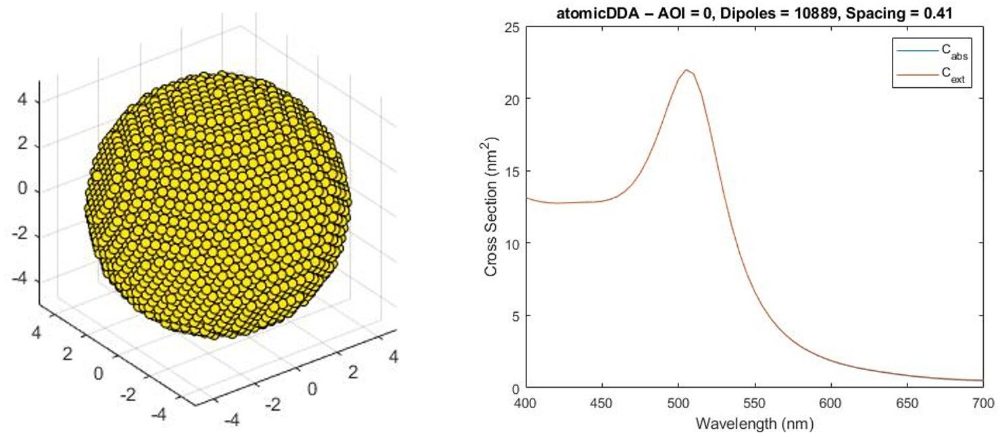

# 400_atomicDDA

*In the last chapter we utilized FFTs/convolutions and the GPU to improve the performance of our code by __two orders of magnitude__. Here we will use the gained speed to bring the discretization to its ultimate limit -- __the atomic scale__ -- where each dipole reprents an atom.*

## A New Grid

Gold usually occurs in a face-centered cubic (fcc) arrangement and has a lattice constant of 0.40782&thinsp;nm . 

So far we used a simple-cubic packing (scp) which nicely maps to cartesian coordinates and, hence, besides a simple scaling no further transformations were needed. Now, we have to implement a proper transformation that maps from a triplet of integer points *(a,b,c)* to floating-point coordinates *(x,y,z)* of the fcc lattice. The transformation look like:

    % Constants
    sin60 = 0.86602540378;
    yPos = 0.288675134594;
    zPos = 0.816496580927;

    % Coordinate transformation
    x = 1.0*a +   0.5*b +  0.5*c;                
    y = 0.0*a + sin60*b + yPos*c;
    z = 0.0*a +   0.0*b + zPos*c;

The fcc and the hexagonal close-packed (hcp) lattices have the closest possible packing  and are <!-- $\sqrt{2}$ -->  more dense than the simple cubic packing (scp) that we have used so far. Hence, we have to increase the in teh code used dipole density `rho` by a factor of  to account for that. Furthermore, the spacing between the dipoles has to be set to  `spacing = d_Au =  0.40782&thinsp;nm`.

## Code Changes

Changed Files               | Notes
:-----                      |:--------
atomicDDA.m                 | main file
create_Spheroid_ext_fcc     | create space for a spheroid in a fcc lattice
create_SpheroidPair_ext_fcc | create space for a pair of spheroids in a fcc lattice

## Results

For a Gold sphere with a diameter of 10&thinsp;nm this results in 10889 atoms and:

    >> atomicDDA
    Building a 9.79nm x 9.79nm spheroid with 226981 grid points and 10889 dipoles
    wav = 400nm -- setting up: 0.0s -- solver: 0.000664   9   0.0s 
    wav = 405nm -- setting up: 0.0s -- solver: 0.000836   2   0.0s 
    wav = 410nm -- setting up: 0.0s -- solver: 0.000807   3   0.0s 
    wav = 415nm -- setting up: 0.0s -- solver: 0.000988   2   0.0s 
    wav = 420nm -- setting up: 0.0s -- solver: 0.000699   3   0.0s 
    wav = 425nm -- setting up: 0.0s -- solver: 0.000715   2   0.0s 
    wav = 430nm -- setting up: 0.0s -- solver: 0.000784   2   0.0s 
    wav = 435nm -- setting up: 0.0s -- solver: 0.000869   2   0.0s 
    wav = 440nm -- setting up: 0.0s -- solver: 0.000984   2   0.0s 
    wav = 445nm -- setting up: 0.0s -- solver: 0.000781   3   0.0s 
    wav = 450nm -- setting up: 0.0s -- solver: 0.000807   2   0.0s 
    wav = 455nm -- setting up: 0.0s -- solver: 0.000929   2   0.0s 
    wav = 460nm -- setting up: 0.0s -- solver: 0.000671   3   0.0s 
    wav = 465nm -- setting up: 0.0s -- solver: 0.000933   2   0.0s 
    wav = 470nm -- setting up: 0.0s -- solver: 0.000799   3   0.0s 
    wav = 475nm -- setting up: 0.0s -- solver: 0.000606   3   0.0s 
    wav = 480nm -- setting up: 0.0s -- solver: 0.000623   3   0.0s 
    wav = 485nm -- setting up: 0.0s -- solver: 0.000767   3   0.0s 
    wav = 490nm -- setting up: 0.0s -- solver: 0.000819   3   0.0s 
    wav = 495nm -- setting up: 0.0s -- solver: 0.000679   4   0.0s 
    wav = 500nm -- setting up: 0.0s -- solver: 0.000749   5   0.0s 
    wav = 505nm -- setting up: 0.0s -- solver: 0.000822   6   0.0s 
    wav = 510nm -- setting up: 0.0s -- solver: 0.000827   7   0.0s 
    wav = 515nm -- setting up: 0.0s -- solver: 0.000827   8   0.0s 
    wav = 520nm -- setting up: 0.0s -- solver: 0.000838   9   0.0s 
    wav = 525nm -- setting up: 0.0s -- solver: 0.000832  10   0.0s 
    wav = 530nm -- setting up: 0.0s -- solver: 0.000954  10   0.0s 
    wav = 535nm -- setting up: 0.0s -- solver: 0.000898  11   0.0s 
    wav = 540nm -- setting up: 0.0s -- solver: 0.000965  12   0.0s 
    wav = 545nm -- setting up: 0.0s -- solver: 0.000943  13   0.0s 
    wav = 550nm -- setting up: 0.0s -- solver: 0.000917  14   0.0s 
    wav = 555nm -- setting up: 0.0s -- solver: 0.000973  14   0.0s 
    wav = 560nm -- setting up: 0.0s -- solver: 0.000919  15   0.0s 
    wav = 565nm -- setting up: 0.0s -- solver: 0.000955  15   0.0s 
    wav = 570nm -- setting up: 0.0s -- solver: 0.000963  16   0.0s 
    wav = 575nm -- setting up: 0.0s -- solver: 0.000959  17   0.0s 
    wav = 580nm -- setting up: 0.0s -- solver: 0.000974  18   0.0s 
    wav = 585nm -- setting up: 0.0s -- solver: 0.000941  19   0.1s 
    wav = 590nm -- setting up: 0.0s -- solver: 0.000954  19   0.1s 
    wav = 595nm -- setting up: 0.0s -- solver: 0.000983  19   0.0s 
    wav = 600nm -- setting up: 0.0s -- solver: 0.000971  20   0.1s 
    wav = 605nm -- setting up: 0.0s -- solver: 0.000986  20   0.1s 
    wav = 610nm -- setting up: 0.0s -- solver: 0.000970  21   0.1s 
    wav = 615nm -- setting up: 0.0s -- solver: 0.000968  21   0.1s 
    wav = 620nm -- setting up: 0.0s -- solver: 0.000981  21   0.1s 
    wav = 625nm -- setting up: 0.0s -- solver: 0.000968  22   0.1s 
    wav = 630nm -- setting up: 0.0s -- solver: 0.000991  21   0.1s 
    wav = 635nm -- setting up: 0.0s -- solver: 0.000981  22   0.1s 
    wav = 640nm -- setting up: 0.0s -- solver: 0.000980  22   0.1s 
    wav = 645nm -- setting up: 0.0s -- solver: 0.000986  22   0.1s 
    wav = 650nm -- setting up: 0.0s -- solver: 0.000999  22   0.1s 
    wav = 655nm -- setting up: 0.0s -- solver: 0.000996  23   0.1s 
    wav = 660nm -- setting up: 0.0s -- solver: 0.000989  23   0.1s 
    wav = 665nm -- setting up: 0.0s -- solver: 0.000996  22   0.1s 
    wav = 670nm -- setting up: 0.0s -- solver: 0.000994  23   0.1s 
    wav = 675nm -- setting up: 0.0s -- solver: 0.000992  24   0.1s 
    wav = 680nm -- setting up: 0.0s -- solver: 0.000992  24   0.1s 
    wav = 685nm -- setting up: 0.0s -- solver: 0.000997  23   0.1s 
    wav = 690nm -- setting up: 0.0s -- solver: 0.000985  25   0.1s 
    wav = 695nm -- setting up: 0.0s -- solver: 0.000981  23   0.1s 
    wav = 700nm -- setting up: 0.0s -- solver: 0.000988  24   0.1s 
    Overall required cpu time: 3.8s

 

 

Which looks aready quite good. Nevertheless, in the [next section](../410_atomicDDA_lattices) we will make everything a bit nicer.