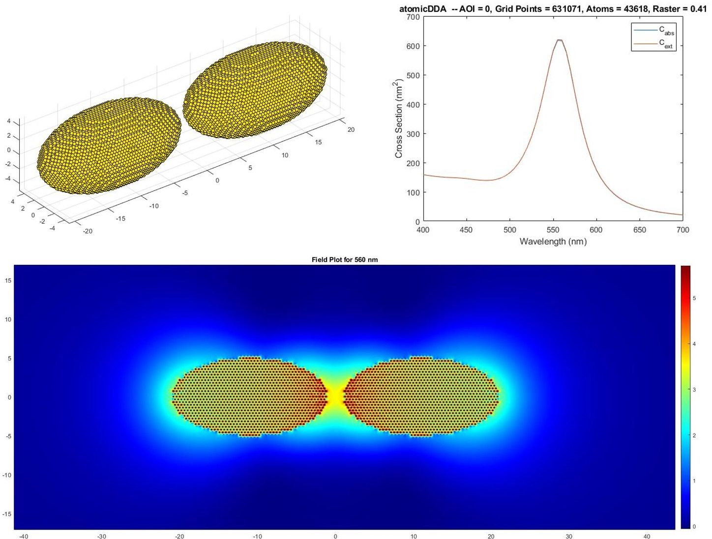

# 410_atomicDDA_lattices

*In the last section we introduced the fcc lattice by implementing it for each geometry. Here, we will provide a better abstraction and also show the first field maps.*

## Abstraction

So far we implemented the lattice together with the geometry. This means for each new lattice -- even when we want to just rotate the lattice by 90 degree -- the construction of the geometry has to be reimplement. This is not ideal and we should use a better abstraction:

* First, we define a lattice object, which contains methods for transferring from the *(a,b,c)* integer base to the *(x,y,z)* real coordinates and back, the dipole density `rho` as well as a *limits* methods, that return the min/max *(a,b,c)* values of an real-space coordinates.

* Then, we define a geometry object, that gives back the limits of the geometry and has a method which is true if a grid point is inside the geometry. 

* Finally, the space is created using the geometry and lattice objects by finding the limits of the space and setting all `r_on` true that are inside the geometry. 

## Field Maps

Besides the spectra one can also calculate electric field maps from the obtained dipole polarizations. The basic algorithm is to define a grid of pixels and then calculate for each pixel the contribution of all dipoles to the local electric field. This can take quite a while. Therefore, we vectorize again by grouping lines of pixels together and also use the GPU.

Furthermore, as dipoles have a singularity at their center, the pixels at atom positions have to be mask to obtain meaningful results. Linear and logarithmic scales are also implemented as well as multi-resolution plots.

## Code Changes

Changed Files           | Notes
:-----                  |:--------
atomicDDA.m             | main file
Lattice_SCP             | simple cubic packing
Lattice_FCC             | face centered cubic packing
Lattice_FCC _Rot        | face centered cubic packing rotated by 90 degree around z axis
Geo_Ellipsoid           | definition of a ellipsoid
Geo_Spheroid            | definition of a spheroid
Geo_SpheroidPair        | definition of a spheroid pair
create_Space            | construction of the grid space
-> find_Limits          | subfunction
-> fill_Space           | subfunction
draw_field              | calculates the E field on a grid
-> create_Plate_atomic  | subfunction
-> E_grid_slow          | subfunction
-> E_grid_cpu           | subfunction
-> E_grid_gpu           | subfunction

## Results

A pair of Gold spheroids with a long axis of 20&thinsp;nm, a short axis of 10&thinsp;nm and a gap of 2&thinsp;nm results in 43618 atoms and:

    >> atomicDDA
    Building a spheroid pair with a size of 36.3nm x 9.9nm x 10.0nm consisting of 631071 
    grid points and 43618 dipoles within 2.1s.
    wav = 400nm -- setting up: 0.0s -- solver: 0.000763  10   0.1s 
    wav = 405nm -- setting up: 0.0s -- solver: 0.000958   3   0.0s 
    wav = 410nm -- setting up: 0.0s -- solver: 0.000922   3   0.0s 
    wav = 415nm -- setting up: 0.0s -- solver: 0.000744   3   0.0s 
    wav = 420nm -- setting up: 0.0s -- solver: 0.000739   3   0.0s 
    wav = 425nm -- setting up: 0.0s -- solver: 0.000775   3   0.0s 
    wav = 430nm -- setting up: 0.0s -- solver: 0.000719   3   0.0s 
    wav = 435nm -- setting up: 0.0s -- solver: 0.000695   3   0.0s 
    wav = 440nm -- setting up: 0.0s -- solver: 0.000726   3   0.0s 
    wav = 445nm -- setting up: 0.0s -- solver: 0.000731   3   0.0s 
    wav = 450nm -- setting up: 0.0s -- solver: 0.000766   3   0.0s 
    wav = 455nm -- setting up: 0.0s -- solver: 0.000816   3   0.0s 
    wav = 460nm -- setting up: 0.0s -- solver: 0.000840   3   0.0s 
    wav = 465nm -- setting up: 0.0s -- solver: 0.000930   3   0.0s 
    wav = 470nm -- setting up: 0.0s -- solver: 0.000989   3   0.0s 
    wav = 475nm -- setting up: 0.0s -- solver: 0.000736   4   0.0s 
    wav = 480nm -- setting up: 0.0s -- solver: 0.000749   4   0.0s 
    wav = 485nm -- setting up: 0.0s -- solver: 0.000904   4   0.0s 
    wav = 490nm -- setting up: 0.0s -- solver: 0.000564   5   0.0s 
    wav = 495nm -- setting up: 0.0s -- solver: 0.000801   5   0.0s 
    wav = 500nm -- setting up: 0.0s -- solver: 0.000826   6   0.0s 
    wav = 505nm -- setting up: 0.0s -- solver: 0.000705   8   0.0s 
    wav = 510nm -- setting up: 0.0s -- solver: 0.000867   9   0.0s 
    wav = 515nm -- setting up: 0.0s -- solver: 0.000855  11   0.0s 
    wav = 520nm -- setting up: 0.0s -- solver: 0.000912  13   0.1s 
    wav = 525nm -- setting up: 0.0s -- solver: 0.000982  15   0.1s 
    wav = 530nm -- setting up: 0.0s -- solver: 0.000934  18   0.1s 
    wav = 535nm -- setting up: 0.0s -- solver: 0.000937  21   0.1s 
    wav = 540nm -- setting up: 0.0s -- solver: 0.000959  24   0.1s 
    wav = 545nm -- setting up: 0.0s -- solver: 0.000974  27   0.1s 
    wav = 550nm -- setting up: 0.0s -- solver: 0.000950  31   0.1s 
    wav = 555nm -- setting up: 0.0s -- solver: 0.000998  34   0.1s 
    wav = 560nm -- setting up: 0.0s -- solver: 0.000952  38   0.2s 
    wav = 565nm -- setting up: 0.0s -- solver: 0.000955  41   0.2s 
    wav = 570nm -- setting up: 0.0s -- solver: 0.000997  43   0.2s 
    wav = 575nm -- setting up: 0.0s -- solver: 0.000977  46   0.2s 
    wav = 580nm -- setting up: 0.0s -- solver: 0.000944  49   0.2s 
    wav = 585nm -- setting up: 0.0s -- solver: 0.000991  50   0.2s 
    wav = 590nm -- setting up: 0.0s -- solver: 0.000954  53   0.2s 
    wav = 595nm -- setting up: 0.0s -- solver: 0.000971  55   0.2s 
    wav = 600nm -- setting up: 0.0s -- solver: 0.000969  57   0.2s 
    wav = 605nm -- setting up: 0.0s -- solver: 0.000964  59   0.2s 
    wav = 610nm -- setting up: 0.0s -- solver: 0.000965  61   0.2s 
    wav = 615nm -- setting up: 0.0s -- solver: 0.000992  62   0.2s 
    wav = 620nm -- setting up: 0.0s -- solver: 0.000980  64   0.2s 
    wav = 625nm -- setting up: 0.0s -- solver: 0.000999  65   0.3s 
    wav = 630nm -- setting up: 0.0s -- solver: 0.000983  67   0.3s 
    wav = 635nm -- setting up: 0.0s -- solver: 0.000991  69   0.3s 
    wav = 640nm -- setting up: 0.0s -- solver: 0.000986  71   0.3s 
    wav = 645nm -- setting up: 0.0s -- solver: 0.000975  73   0.3s 
    wav = 650nm -- setting up: 0.0s -- solver: 0.000987  74   0.3s 
    wav = 655nm -- setting up: 0.0s -- solver: 0.000999  75   0.3s 
    wav = 660nm -- setting up: 0.0s -- solver: 0.000996  76   0.3s 
    wav = 665nm -- setting up: 0.0s -- solver: 0.000999  77   0.3s 
    wav = 670nm -- setting up: 0.0s -- solver: 0.000986  79   0.3s 
    wav = 675nm -- setting up: 0.0s -- solver: 0.000997  80   0.3s 
    wav = 680nm -- setting up: 0.0s -- solver: 0.000984  82   0.3s 
    wav = 685nm -- setting up: 0.0s -- solver: 0.000991  83   0.3s 
    wav = 690nm -- setting up: 0.0s -- solver: 0.000989  84   0.3s 
    wav = 695nm -- setting up: 0.0s -- solver: 0.000988  85   0.3s 
    wav = 700nm -- setting up: 0.0s -- solver: 0.000984  86   0.3s 
    Overall required cpu time: 10.4s

 

 

This looks very nice now. In the [next section](../420_atomicDDA_stacking-faults) we will introduce lattices with stacking faults.