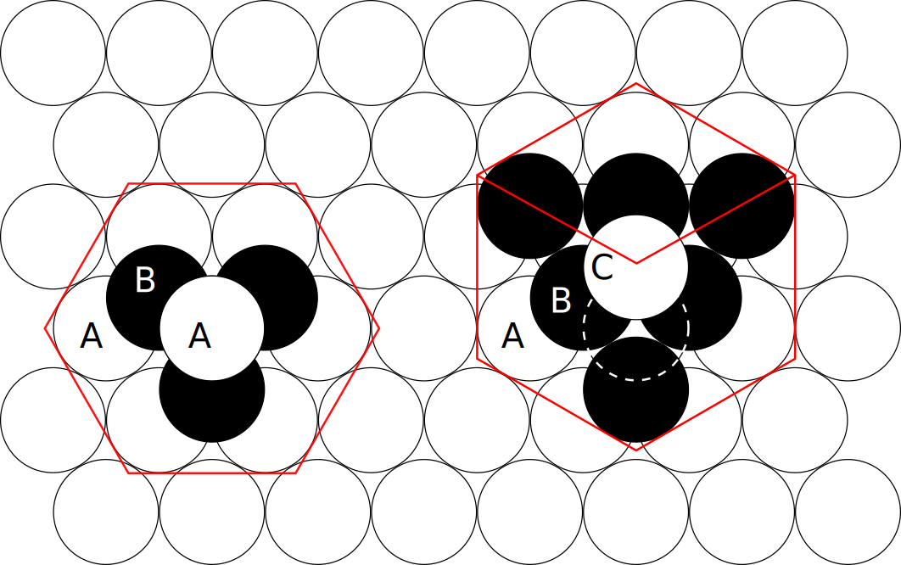
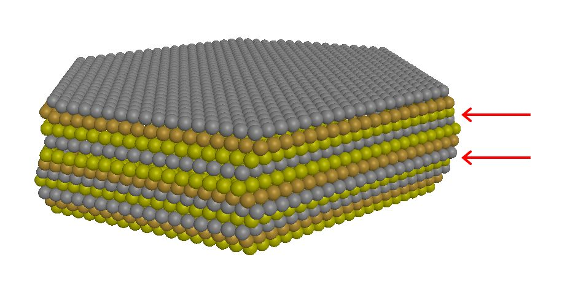
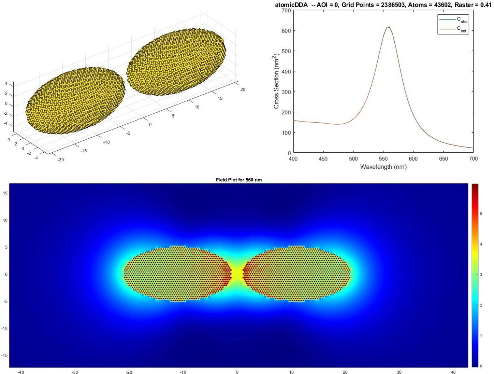

# 420_atomicDDA_stacking-faults

*In the last section we abstracted the lattices implementation. Here we will make use of that and implement an abc lattice with stacking faults which is needed for simulating single-crystalline nanostructures.*

## Motivation

There are different kind of crystalline nanostructures: 

* On the one hand we have unprocessed chemically grown nanoparticles which often do not have the fcc symmetry we discussed in the last section but depending on the shape different symmetries. For example gold, silver and copper nanorods/wires have a 5-fold twinned pentagonal symmetry [-- see Xia et al. 2009](https://www.doi.org/10.1002/anie.200802248). Hence, for each shape type new symmetries have to be implemented.

* On the other hand one can grow closely packed (gold) flakes first [[1](https://www.doi.org/10.1002/crat.201400429),[2](https://www.doi.org/10.1021/acs.cgd.7b00849)] and then structure them using a focused ion beam microscope [[3](https://www.doi.org/10.1038/ncomms1143),[4](https://www.doi.org/10.1021/nl3007374),[5](https://www.doi.org/10.1038/nphoton.2015.141),[6](https://www.doi.org/10.1038/s41467-019-14011-6),[7](https://www.doi.org/10.1021/acs.nanolett.1c00182)] to obtain arbitrarily shaped single-crystalline nanostructures. In this case the lattice symmetries is independent of the shape. 

Here we will go with the latter.

In general, there are two ways to closely package spheres: hcp and fcc lattices. They both show a hexagonal arrangement of the individual layers but differentiate themselves in the way these layers are stacked upon each other. Below is an image from wikipedia illustrating the hcp stacking on the left and fcc stacking on the right hand side.  

 

 

When one assigns *A*, *B* & *C* to the layer positions then hcp is always ABABABABA..., while fcc is either ABCABCABC... or CBACBACBA... . However, by chance they can also be mixed together during growth and we get for example a ABCABC<b>ABA</b>CBACBA stacking which shows a so called *stacking fault* in the center. In order to get flakes to grow one actually needs a seed with two stacking faults. To illustrate that a small flake is depicted below:

 

 

In this sketch the different layer positions are highlighted in gold, bronze & silver colors and the stacking order is ABC<b>A</b>CBA<b>C</b>ABC (bottom to top) with the faults indicated by red arrows.

Hence, if we want to simulate flakes and arbitrarily-shaped nanostructures made of them we have to implement ABC lattices with stacking faults.

## Implementation

The basic idea behind implementing the stacking faults with hcp, fcc and inverse ffc lattices is to introduce a more general grid that can hold all of these lattices. Hence, we add a forth parameter *d* to our integer triplet *(a,b,c)* that hold the position and the transformation for, e.g. *Lattice_ABC_Dir_Y* reads like

    % Coordinate transformation
    x = 1.0*a + 0.5*b + 0.5*c;
    y = 0.0*a + sin60*b + yPos*(c+2*(d-1));
    z = 0.0*a +   0.0*b + zPos*c;  

This means, we shift the *y* position of the atom depending on the value of *d*. But, which combinations of *(a,b,c,d)* for a given stacking are allowed? The answer is all but obvious and for *Lattice_ABC_Dir_Y* as following:

    % check if atoms are allowed
    lattice.okay = @(a,b,c,d) ( mod((c-stacking.pos(c)+1),lattice.layerNumber) == d );

with `lattice.layerNumber = 3` in all our cases and `stacking.pos(c)` the difference in position compared to the normal fcc case and depending on the actual stacking. For defining the latter we created a stacking object.

Note, filling the space can be done by looping over the *(a,b,c,d)* parameters in various ways. We found the numerically most stable are:
    
    Lattice_ABC_Dir_Y & Lattice_ABC_Dir_XY_rot ->  c-a-b-d 
    Lattice_ABC_Dir_XY & Lattice_ABC_Dir_Y_rot ->  c-b-a-d

## Code Changes

Changed Files           | Notes
:-----                  |:--------
atomicDDA.m             | main file
Stacking_ABC            | definition of the stacking-fault positions
show2D                  | better visualization of the grid & stacking faults
show3D                  | normal 3D visualization
Lattice_ABC_Dir_XY      | ABC lattice with shift in XY direction
Lattice_ABC_Dir_XY_Rot  | ABC lattice with shift in XY direction rotated by 90 degree 
Lattice_ABC_Dir_Y       | ABC lattice with shift in Y direction
Lattice_ABC_Dir_Y_Rot   | ABC lattice with shift in Y direction rotated by 90 degree 
fill_Limits_simple      | updated with stacking faults 
fill_Limits             | updated with stacking faults -- fast version
fill_Space_simple       | updated with stacking faults
fill_Space              | updated with stacking faults -- fast version

## Results

A pair of Gold spheroids with [-3,4] stacking, a long axis of 20 nm, a short axis of 10 nm and a gap of 2 nm results in 43602 atoms and:

    >> atomicDDA
    Building a spheroid pair with a size of 41.6nm x 9.9nm x 10.0nm consisting of 2386503 
    grid points and 43602 dipoles within 0.1s.
    wav = 400nm -- setting up: 0.0s -- solver: 0.000679   9   0.2s 
    wav = 405nm -- setting up: 0.0s -- solver: 0.000961   2   0.1s 
    wav = 410nm -- setting up: 0.0s -- solver: 0.000596   3   0.1s 
    wav = 415nm -- setting up: 0.0s -- solver: 0.000791   2   0.1s 
    wav = 420nm -- setting up: 0.0s -- solver: 0.000914   2   0.1s 
    wav = 425nm -- setting up: 0.0s -- solver: 0.000807   2   0.1s 
    wav = 430nm -- setting up: 0.0s -- solver: 0.000727   2   0.1s 
    wav = 435nm -- setting up: 0.0s -- solver: 0.000734   2   0.1s 
    wav = 440nm -- setting up: 0.0s -- solver: 0.000757   2   0.1s 
    wav = 445nm -- setting up: 0.0s -- solver: 0.000776   2   0.1s 
    wav = 450nm -- setting up: 0.0s -- solver: 0.000838   2   0.0s 
    wav = 455nm -- setting up: 0.0s -- solver: 0.000900   2   0.1s 
    wav = 460nm -- setting up: 0.0s -- solver: 0.000965   2   0.1s 
    wav = 465nm -- setting up: 0.0s -- solver: 0.000568   3   0.1s 
    wav = 470nm -- setting up: 0.1s -- solver: 0.000894   2   0.1s 
    wav = 475nm -- setting up: 0.0s -- solver: 0.000715   3   0.1s 
    wav = 480nm -- setting up: 0.0s -- solver: 0.000668   3   0.1s 
    wav = 485nm -- setting up: 0.0s -- solver: 0.000845   3   0.1s 
    wav = 490nm -- setting up: 0.0s -- solver: 0.000658   4   0.1s 
    wav = 495nm -- setting up: 0.0s -- solver: 0.000798   4   0.1s 
    wav = 500nm -- setting up: 0.0s -- solver: 0.000666   5   0.1s 
    wav = 505nm -- setting up: 0.0s -- solver: 0.000983   5   0.1s 
    wav = 510nm -- setting up: 0.0s -- solver: 0.000926   7   0.1s 
    wav = 515nm -- setting up: 0.0s -- solver: 0.000862   9   0.1s 
    wav = 520nm -- setting up: 0.0s -- solver: 0.000882  11   0.2s 
    wav = 525nm -- setting up: 0.0s -- solver: 0.000932  13   0.2s 
    wav = 530nm -- setting up: 0.0s -- solver: 0.000952  15   0.2s 
    wav = 535nm -- setting up: 0.0s -- solver: 0.000933  18   0.2s 
    wav = 540nm -- setting up: 0.0s -- solver: 0.000924  21   0.3s 
    wav = 545nm -- setting up: 0.0s -- solver: 0.000953  24   0.3s 
    wav = 550nm -- setting up: 0.0s -- solver: 0.000980  27   0.4s 
    wav = 555nm -- setting up: 0.0s -- solver: 0.000922  31   0.4s 
    wav = 560nm -- setting up: 0.0s -- solver: 0.000938  34   0.5s 
    wav = 565nm -- setting up: 0.0s -- solver: 0.000993  36   0.4s 
    wav = 570nm -- setting up: 0.0s -- solver: 0.000971  39   0.5s 
    wav = 575nm -- setting up: 0.0s -- solver: 0.000985  41   0.5s 
    wav = 580nm -- setting up: 0.0s -- solver: 0.000994  43   0.5s 
    wav = 585nm -- setting up: 0.0s -- solver: 0.000973  45   0.6s 
    wav = 590nm -- setting up: 0.0s -- solver: 0.000958  47   0.6s 
    wav = 595nm -- setting up: 0.0s -- solver: 0.000990  48   0.6s 
    wav = 600nm -- setting up: 0.0s -- solver: 0.000962  50   0.7s 
    wav = 605nm -- setting up: 0.0s -- solver: 0.000978  51   0.6s 
    wav = 610nm -- setting up: 0.1s -- solver: 0.000995  52   0.6s 
    wav = 615nm -- setting up: 0.0s -- solver: 0.000999  53   0.6s 
    wav = 620nm -- setting up: 0.0s -- solver: 0.000970  55   0.7s 
    wav = 625nm -- setting up: 0.0s -- solver: 0.000997  55   0.7s 
    wav = 630nm -- setting up: 0.0s -- solver: 0.000995  56   0.7s 
    wav = 635nm -- setting up: 0.0s -- solver: 0.000999  57   0.7s 
    wav = 640nm -- setting up: 0.0s -- solver: 0.000978  59   0.7s 
    wav = 645nm -- setting up: 0.0s -- solver: 0.000996  59   0.7s 
    wav = 650nm -- setting up: 0.0s -- solver: 0.000995  60   0.7s 
    wav = 655nm -- setting up: 0.0s -- solver: 0.000989  61   0.7s 
    wav = 660nm -- setting up: 0.0s -- solver: 0.000984  62   0.7s 
    wav = 665nm -- setting up: 0.0s -- solver: 0.000987  62   0.7s 
    wav = 670nm -- setting up: 0.0s -- solver: 0.000998  62   0.7s 
    wav = 675nm -- setting up: 0.0s -- solver: 0.000988  63   0.7s 
    wav = 680nm -- setting up: 0.0s -- solver: 0.000992  63   0.7s 
    wav = 685nm -- setting up: 0.0s -- solver: 0.000990  64   0.7s 
    wav = 690nm -- setting up: 0.0s -- solver: 0.000986  65   0.7s 
    wav = 695nm -- setting up: 0.0s -- solver: 0.000994  65   0.7s 
    wav = 700nm -- setting up: 0.0s -- solver: 0.000995  66   0.8s 
    Overall required cpu time: 28.3s

Note, by switching from the pure fcc to the abc lattice we went from 631.071 to 2.386.503 grid points and 10.4&thinsp;s to 28.3&thinsp;s but the number of atoms stayed more or less constant 43618 -> 43602.

 

 

As expected, even though the stacking is different, the spectra and field distribution did not change much. In the [next section](../430_atomicDDA_flakes) we will import Gold flakes and structures thereof. 