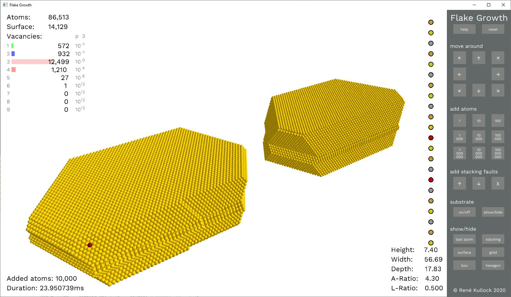
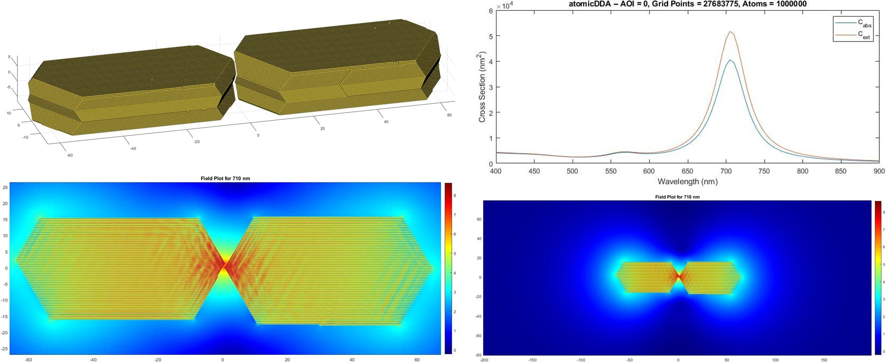

# 430_atomicDDA_flakes

*Since we have implemented all necessary ingredients by now, we can finally go the last step and import arbitrary structure made of gold flakes.*

## Structures

The nanostructures are generated and exported using the flake-growing simulation (*"Flake-Growth"*) which can be found [here](https://github.com/Rene-007/flake_growth). It allows not only to simulate the growth of gold flakes for various parameter but also the regrowth of structured flakes. An example of a regrown dimer is shown here: 

 

 

The positions of the atoms can be exported from *Flake-Growth* in a `Lattice_ABC_Dir_Y` grid and, hence, we can reuse the data within our *atomicDDA* code.

## Implementation

In order to import the data, the particle creation part had to be refactored into its own function `create_ParticleSpace` such that an equivalent `create_FlakeSpace` could be written which imports the data, extracts the stacking faults & atom positions as well as builds the grid space.

As surface atoms are also marked by *Flake-Growth*, we can now neglect bulk atoms only draw them. This speeds up the 3D visualization of our structures significantly. 

The remaining code did not change significantly.

## Code Changes

Changed Files           | Notes
:-----                  |:--------
atomicDDA.m             | main file
create_ParticleSpace    | refactored part of particle creation
create_FlakeSpace       | flake creation
-> import_flake         | subfunction: import flake data from file
-> Stacking_Flake       | subfunction: some stacking routines
-> Geo_Flake            | subfunction: for extracting extrema
-> fill_FlakeSpace      | subfunction: create a new space and fill it

## Results

For an imported regrown gold dimer consisting of 1.000.000 atoms the calculation resulted in:

    >> atomicDDA
    Importing a flake with a size of 128.5nm x 35.2nm x 15.0nm consisting of 27683775 
    grid points and 1000000 atoms within 1.144s.
    wav = 400nm -- setting up: 1.0s -- solver: 0.000724  10   2.5s 
    wav = 405nm -- setting up: 0.7s -- solver: 0.000607   4   1.1s 
    wav = 410nm -- setting up: 0.6s -- solver: 0.000595   4   1.0s 
    wav = 415nm -- setting up: 0.6s -- solver: 0.000571   4   1.1s 
    wav = 420nm -- setting up: 0.7s -- solver: 0.000553   4   1.0s 
    wav = 425nm -- setting up: 0.6s -- solver: 0.000532   4   1.0s 
    wav = 430nm -- setting up: 0.6s -- solver: 0.000969   3   0.9s 
    wav = 435nm -- setting up: 0.7s -- solver: 0.000587   4   1.0s 
    wav = 440nm -- setting up: 0.6s -- solver: 0.000966   3   0.9s 
    wav = 445nm -- setting up: 0.6s -- solver: 0.000621   4   1.1s 
    wav = 450nm -- setting up: 0.6s -- solver: 0.000549   4   1.0s 
    wav = 455nm -- setting up: 0.7s -- solver: 0.000580   4   1.0s 
    wav = 460nm -- setting up: 0.6s -- solver: 0.000584   4   1.1s 
    wav = 465nm -- setting up: 0.6s -- solver: 0.000602   4   1.0s 
    wav = 470nm -- setting up: 0.7s -- solver: 0.000606   4   1.0s 
    wav = 475nm -- setting up: 0.6s -- solver: 0.000630   4   1.1s 
    wav = 480nm -- setting up: 0.6s -- solver: 0.000660   4   1.0s 
    wav = 485nm -- setting up: 0.7s -- solver: 0.000682   4   1.0s 
    wav = 490nm -- setting up: 0.6s -- solver: 0.000930   4   1.1s 
    wav = 495nm -- setting up: 0.6s -- solver: 0.000728   5   1.2s 
    wav = 500nm -- setting up: 0.7s -- solver: 0.000802   6   1.3s 
    wav = 505nm -- setting up: 0.6s -- solver: 0.000895   7   1.4s 
    wav = 510nm -- setting up: 0.6s -- solver: 0.000921   8   1.6s 
    wav = 515nm -- setting up: 0.6s -- solver: 0.000950   9   1.7s 
    wav = 520nm -- setting up: 0.6s -- solver: 0.000895  11   1.9s 
    wav = 525nm -- setting up: 0.6s -- solver: 0.000863  13   2.3s 
    wav = 530nm -- setting up: 0.7s -- solver: 0.000900  15   2.4s 
    wav = 535nm -- setting up: 0.6s -- solver: 0.000885  17   2.7s 
    wav = 540nm -- setting up: 0.6s -- solver: 0.000950  19   2.9s 
    wav = 545nm -- setting up: 0.7s -- solver: 0.000952  22   3.3s 
    wav = 550nm -- setting up: 0.6s -- solver: 0.000946  25   3.8s 
    wav = 555nm -- setting up: 0.6s -- solver: 0.000952  28   4.1s 
    wav = 560nm -- setting up: 0.7s -- solver: 0.000988  31   4.4s 
    wav = 565nm -- setting up: 0.6s -- solver: 0.000932  35   4.9s 
    wav = 570nm -- setting up: 0.7s -- solver: 0.000988  38   5.3s 
    wav = 575nm -- setting up: 0.6s -- solver: 0.000975  42   5.8s 
    wav = 580nm -- setting up: 0.6s -- solver: 0.000995  45   5.9s 
    wav = 585nm -- setting up: 0.6s -- solver: 0.001000  48   6.2s 
    wav = 590nm -- setting up: 0.6s -- solver: 0.000960  52   6.7s 
    wav = 595nm -- setting up: 0.7s -- solver: 0.000982  55   7.1s 
    wav = 600nm -- setting up: 0.6s -- solver: 0.000967  59   7.6s 
    wav = 605nm -- setting up: 0.6s -- solver: 0.000995  62   7.9s 
    wav = 610nm -- setting up: 0.6s -- solver: 0.000995  66   8.4s 
    wav = 615nm -- setting up: 0.7s -- solver: 0.000972  71   8.9s 
    wav = 620nm -- setting up: 0.6s -- solver: 0.000998  75   9.4s 
    wav = 625nm -- setting up: 0.7s -- solver: 0.000996  80  10.0s 
    wav = 630nm -- setting up: 0.6s -- solver: 0.000990  86  10.7s 
    wav = 635nm -- setting up: 0.6s -- solver: 0.000983  93  11.6s 
    wav = 640nm -- setting up: 0.7s -- solver: 0.000984 100  12.4s 
    wav = 645nm -- setting up: 0.6s -- solver: 0.000992 107  13.2s 
    wav = 650nm -- setting up: 0.6s -- solver: 0.001000 115  14.2s 
    wav = 655nm -- setting up: 0.6s -- solver: 0.001000 124  15.3s 
    wav = 660nm -- setting up: 0.6s -- solver: 0.000996 134  16.5s 
    wav = 665nm -- setting up: 0.7s -- solver: 0.000987 145  17.7s 
    wav = 670nm -- setting up: 0.7s -- solver: 0.000997 156  19.0s 
    wav = 675nm -- setting up: 0.6s -- solver: 0.000997 169  20.6s 
    wav = 680nm -- setting up: 0.7s -- solver: 0.000994 183  22.3s 
    wav = 685nm -- setting up: 0.6s -- solver: 0.000988 198  24.0s 
    wav = 690nm -- setting up: 0.7s -- solver: 0.000995 213  25.8s 
    wav = 695nm -- setting up: 0.7s -- solver: 0.000996 228  27.6s 
    wav = 700nm -- setting up: 0.7s -- solver: 0.000993 242  29.3s 
    wav = 705nm -- setting up: 0.6s -- solver: 0.000996 253  30.6s 
    wav = 710nm -- setting up: 0.6s -- solver: 0.000998 261  31.6s 
    wav = 715nm -- setting up: 0.6s -- solver: 0.000992 267  32.3s 
    wav = 720nm -- setting up: 0.7s -- solver: 0.000998 270  32.4s 
    wav = 725nm -- setting up: 0.6s -- solver: 0.000993 267  32.1s 
    wav = 730nm -- setting up: 0.7s -- solver: 0.000999 262  31.5s 
    wav = 735nm -- setting up: 0.6s -- solver: 0.000995 258  31.0s 
    wav = 740nm -- setting up: 0.7s -- solver: 0.000997 253  30.4s 
    wav = 745nm -- setting up: 0.6s -- solver: 0.000998 249  30.0s 
    wav = 750nm -- setting up: 0.6s -- solver: 0.000992 247  29.7s 
    wav = 755nm -- setting up: 0.6s -- solver: 0.000995 243  29.2s 
    wav = 760nm -- setting up: 0.6s -- solver: 0.000999 240  28.9s 
    wav = 765nm -- setting up: 0.6s -- solver: 0.000994 239  28.7s 
    wav = 770nm -- setting up: 0.6s -- solver: 0.000996 237  28.5s 
    wav = 775nm -- setting up: 0.6s -- solver: 0.000992 235  28.3s 
    wav = 780nm -- setting up: 0.6s -- solver: 0.000995 232  28.0s 
    wav = 785nm -- setting up: 0.7s -- solver: 0.000994 230  27.7s 
    wav = 790nm -- setting up: 0.6s -- solver: 0.000999 227  27.3s 
    wav = 795nm -- setting up: 0.6s -- solver: 0.000999 224  27.0s 
    wav = 800nm -- setting up: 0.6s -- solver: 0.000996 222  26.8s 
    wav = 805nm -- setting up: 0.6s -- solver: 0.000997 220  26.5s 
    wav = 810nm -- setting up: 0.6s -- solver: 0.000999 218  26.3s 
    wav = 815nm -- setting up: 0.7s -- solver: 0.001000 216  26.0s 
    wav = 820nm -- setting up: 0.6s -- solver: 0.000995 214  25.8s 
    wav = 825nm -- setting up: 0.6s -- solver: 0.000994 211  25.4s 
    wav = 830nm -- setting up: 0.7s -- solver: 0.000996 208  25.1s 
    wav = 835nm -- setting up: 0.6s -- solver: 0.000999 206  24.9s 
    wav = 840nm -- setting up: 0.6s -- solver: 0.000997 203  24.5s 
    wav = 845nm -- setting up: 0.7s -- solver: 0.000998 199  24.0s 
    wav = 850nm -- setting up: 0.6s -- solver: 0.000996 197  23.9s 
    wav = 855nm -- setting up: 0.6s -- solver: 0.000999 194  23.5s 
    wav = 860nm -- setting up: 0.6s -- solver: 0.000995 191  23.1s 
    wav = 865nm -- setting up: 0.6s -- solver: 0.000997 185  22.4s 
    wav = 870nm -- setting up: 0.6s -- solver: 0.000998 181  21.9s 
    wav = 875nm -- setting up: 0.6s -- solver: 0.000994 180  21.8s 
    wav = 880nm -- setting up: 0.6s -- solver: 0.000999 177  21.5s 
    wav = 885nm -- setting up: 0.6s -- solver: 0.000996 175  21.2s 
    wav = 890nm -- setting up: 0.6s -- solver: 0.000999 170  20.6s 
    wav = 895nm -- setting up: 0.6s -- solver: 0.000998 166  20.2s 
    wav = 900nm -- setting up: 0.7s -- solver: 0.000998 162  19.7s 
    Overall required cpu time: 1620.1s

The cpu time of 1620&thinsp;s means that it took just ~27&thinsp;min for simulating 1 million atoms at 101 wavelength points!

Considering that such dimer sizes (128.5&thinsp;nm x 35.2&thinsp;nm x 15.0&thinsp;nm) should be possible to preciesely manufacturable with a combination of top-down and bottom-up methods, controlling electric fields on the atomic scale seems to be within reach.

Finally, we can also obtain spectra and near-field distributions:

 

 

Note, the field inside the dimer shows some structure, which is probably due to reflections of the field at the interfaces. The detailed arrangement of atoms in the gap region is very important for the field enhancement and spectral shape, too. 

In the [last section](../440_atomicDDA_flat) there is a variant of the code with a flatten memory layout of the vectors, i.e. a lot of vector/matrix transpositions should be saved. However, our Matlab code seems to perform the same and, hence, no further documentation is provided.

This closes our small course on implementing the *DDA* algorithm efficiently and applying it to nanostructure on the atomic scale. I hope, you enjoyed it!